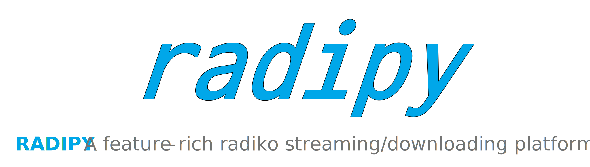
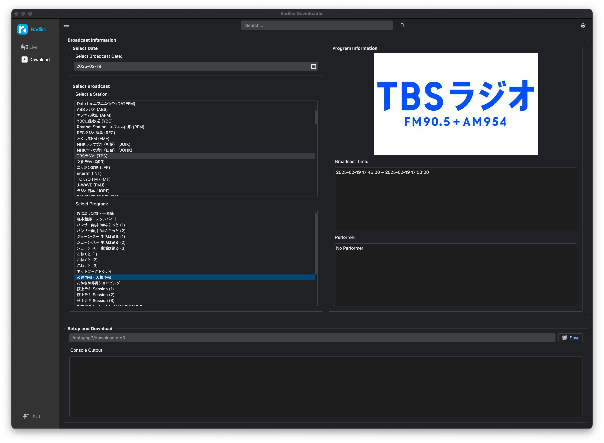

<div align="center">

  [](#readme)

  [](LICENSE "License")
  [](#release-files "Release Files")
  [](https://github.com/devhaaana/radipy/commits "Commit History")
  [](https://github.com/devhaaana/radipy/pulse/monthly "Last Commit")

</div>

<br />

<div align="center">

[ENGLISH](/README.md)  ·  [한국어](/documents/README-KR.md)  ·  [日本語](/documents/README-JP.md)

</div>

<br />

`radipy`는 일본 라디오 서비스인 [radiko.jp](https://radiko.jp/)의 방송을 일본 외 지역에서 스트리밍하고 다운로드할 수 있는 PyQt5 기반의 데스크톱 애플리케이션입니다.

## 인덱스

- [인덱스](#인덱스)
- [아키텍처](#아키텍처)
- [경고](#경고)
- [사용 기술](#사용-기술)
- [기술적 세부사항](#기술적-세부사항)
- [시작하기](#시작하기)
  - [설치](#설치)
  - [사용 방법](#사용-방법)
- [릴리스 파일](#릴리스-파일)
- [참고](#참고)

## 아키텍처

```
radipy
├─ LICENSE
├─ README.md
├─ data
│  ├─ auth
│  │  └─ auth_key.bin
│  └─ json
│     └─ area.json
├─ images
│  ├─ icons
│  │  ├─ dark
│  │  │  ├─ antenna-512-color.png
│  │  │  ├─ antenna-512.png
│  │  │  ├─ exit-512.png
│  │  │  ├─ menu-32.png
│  │  │  ├─ save-512-bg.png
│  │  │  ├─ save-512.png
│  │  │  ├─ search-32.png
│  │  │  └─ settings-32.png
│  │  ├─ light
│  │  │  ├─ antenna-512-color.png
│  │  │  ├─ antenna-512.png
│  │  │  ├─ exit-512.png
│  │  │  ├─ menu-32.png
│  │  │  ├─ save-512-bg.png
│  │  │  ├─ save-512.png
│  │  │  ├─ search-32.png
│  │  │  └─ settings-32.png
│  │  ├─ podcasts-32.png
│  │  └─ settings.png
│  └─ images
│     ├─ banner.svg
│     ├─ profile-circle.png
│     └─ radiko.png
├─ main.py
├─ radiko.py
├─ requirements.txt
├─ sample
│  ├─ base-ui-download.png
│  └─ base-ui-live.png
├─ style
│  ├─ dark_style.qss
│  ├─ light_style.qss
│  └─ style.qss
└─ ui_pyqt5.py
```

## 경고

**이 프로젝트를 상업적인 용도로 사용하지 마십시오. 개인적, 비상업적인 용도로만 사용해 주세요.**

## 사용 기술

- `Python` : 3.12
- `PyQt`
- `FFmpeg`

## 기술적 세부사항

PC(HTML5) 버전의 Radiko는 사용자의 위치를 IP 주소를 통해 인증합니다.
그러나 Android 버전의 Radiko는 IP 주소가 아닌 GPS 정보를 기반으로 사용자를 인증합니다.

## 시작하기

### 설치

- **로컬** 설치
  ```console
  $ git clone https://github.com/devhaaana/radipy.git
  $ cd radipy
  ```
- 시스템에 **Python**이 설치되어 있는지 확인한 후, 다음 명령어를 실행하여 **필요한 패키지**를 설치하세요.
  ```console
  conda create -n radiko_env python=3.12
  conda activate radiko_env
  pip install -r requirements.txt
  ```

### 사용 방법

```console
python main.py
```




## 릴리스 파일

| File                                                                                    | Description                                            |
| :-------------------------------------------------------------------------------------- | :----------------------------------------------------- |
| [radipy-1.0.0.zip](https://github.com/devhaaana/radipy/archive/refs/tags/v1.0.0.zip)       | radipy v1.0.0의 전체 소스 코드가 포함된*ZIP* 파일    |
| [radipy-1.0.0.tar.gz](https://github.com/devhaaana/radipy/archive/refs/tags/v1.0.0.tar.gz) | radipy v1.0.0의 전체 소스 코드가 포함된*TAR.GZ* 파일 |

## 참고

- [rajiko](https://github.com/jackyzy823/rajiko)
- [radiko-downloader](https://github.com/devhaaana/radiko-downloader.git)

<br />

<div align="center">

  [](https://hits.seeyoufarm.com)

</div>
